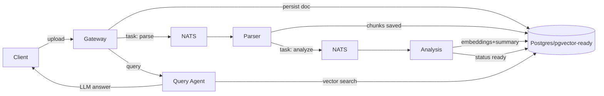

# doc-agents

**Multi-Agent Document Processing System with RAG (Retrieval-Augmented Generation)**

A Go-based multi-agent system that processes documents through specialized agents (parser, analysis, query) orchestrated via NATS and backed by Postgres with pgvector for semantic search.

## Architecture

- API Gateway (`cmd/gateway`): accepts uploads, exposes summary + query endpoints, enqueues parse tasks.
- Parser Agent (`cmd/parser`): extracts text/chunks from documents and emits analysis tasks.
- Analysis Agent (`cmd/analysis`): summarizes documents, creates embeddings, marks docs ready.
- Query Agent (`cmd/query`): semantic search + question answering over stored embeddings.
- Shared infra: Postgres (pgx) for persistence, NATS for the task bus; in-memory fallbacks for quick local runs.



## Endpoints (gateway)
- `POST /api/documents/upload` (multipart `file`): returns `{document_id, status}` and enqueues parsing.
- `GET /api/documents/{id}/summary`: returns `summary`, `key_points`.
- `POST /api/query` body `{"question":"...","document_ids":["uuid"],"top_k":5}` → `{answer,sources,confidence}`.
- `GET /healthz`

Query agent also exposes `POST /api/query` on its own port for direct access.

## Running locally

```bash
# 1) install deps
go mod tidy

# 2) start full stack
docker-compose up --build

# 3) hit the gateway
curl -F "file=@./sample.txt" http://localhost:8080/api/documents/upload
curl http://localhost:8080/api/documents/<id>/summary
curl -XPOST -H "Content-Type: application/json" \
  -d '{"question":"What is this about?","document_ids":["<id>"]}' \
  http://localhost:8080/api/query
```

Environment defaults live in `env.example`. Set `QUEUE_DRIVER=memory` to bypass NATS in dev, or supply `QUEUE_URL` for NATS JetStream. Provide `DB_URL` to use Postgres; otherwise the services fall back to in-memory stores (not shared across processes).

## Design Notes
- **Chunking**: sliding window (default 400 tokens, 80 overlap) based on whitespace tokenization in `internal/chunker`.
- **Queue**: pluggable; in-memory priority queue with exponential backoff, or NATS-based publisher/subscriber (`internal/queue`).
- **Embeddings**: stub deterministic vectors in `internal/embeddings`; swap with real embedding client. Cosine similarity for semantic search.
- **LLM**: stub client in `internal/llm`; replace with OpenAI/Anthropic easily by implementing the interface.
- **Persistence**: Postgres store (`internal/store/postgres.go`) persists docs, chunks, summaries, embeddings (vector JSON). Memory store available for tests.
- **Agents**: each service owns only its concern; communication through the queue. Gateway stays thin.

## Testing

```bash
go test ./...
```

Current coverage includes chunking and queue backoff logic. Add integration tests that spin up NATS/Postgres using `docker-compose` and hit the HTTP endpoints.

## Limitations / TODOs
- PDF parsing is stubbed; integrate `ledongthuc/pdf` or `pdfcpu` for production.
- Replace stub LLM/embeddings with real providers and prompt templates.
- Enhance vector search using `pgvector` or Qdrant for scalable similarity search.
- Harden NATS worker ack/retry and add idempotency keys.
- Add auth/rate limiting and tracing (OpenTelemetry) hooks.

